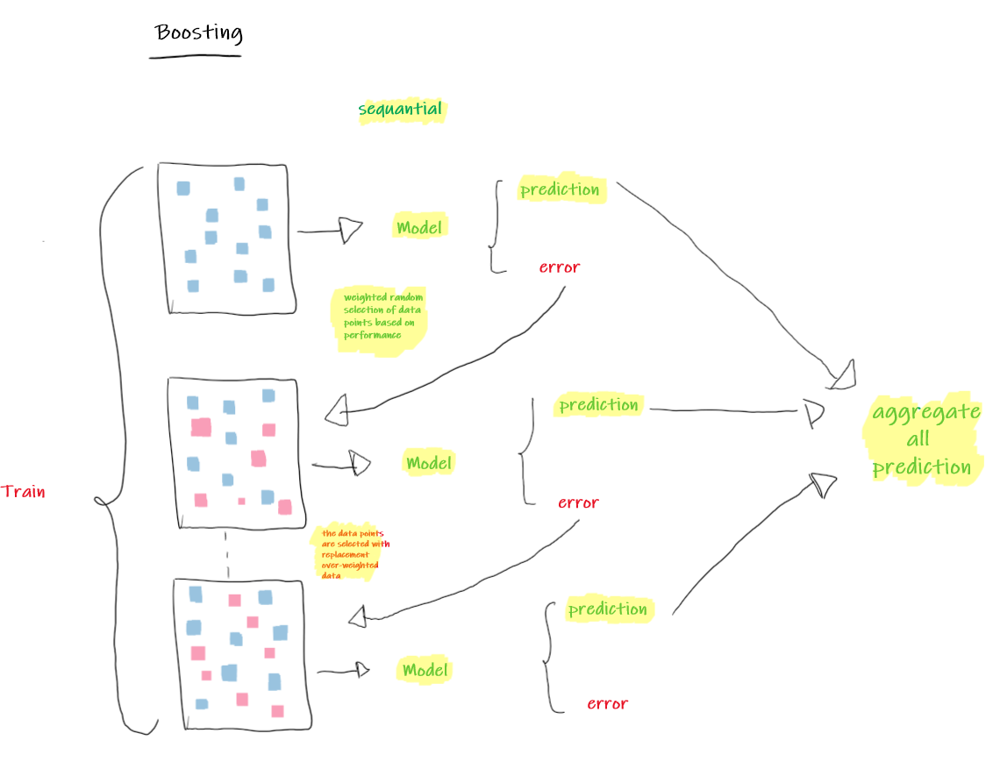

<style>
body {
text-align: justify}
</style>


# Introduction {.tabset}

## What is boosting?

Boosting is an ensemble method of converting weak learners into strong learners. Weak and strong refer to a measure how correlated are the learners to the actual target variable[^1]. In boosting, each training sample are used to train one unit of decision tree and picked with replacement over-weighted data. The trees will learn from predecessors and updates the residuals error.


## Learning Objectives

The goal of this article is to help you:

- Understand the concept of boosting

- Compare boosting and bagging method

- Understand how XGBoost algorithm works

- Implement Xgboost in business case


## Library and setup

```{r message=F, warning=F}
library(tidyverse)
library(rsample)
library(xgboost)
```


```{r setup, include=FALSE}
# clear-up the environment
rm(list = ls())
# chunk options
knitr::opts_chunk$set(
  message = FALSE,
  warning = FALSE,
  fig.align = "center",
  comment = "#>"
)
options(scipen = 99)
```

# Bagging vs Boosting

The idea of bagging is creating many subsets of training sample with replacement, each observation has the same probability to picked as sample. Then, each training sample are used to train one unit of decision tree and use the average of all the predictions. In boosting, each training sample are used to train one unit of decision tree and picked with replacement over-weighted data. The trees will learn from predecessors and updates the residuals error. After these weak learners are trained, a weighted average of their estimates are taken for the final predictions at the end[^2].

```{r, echo=FALSE}

```


# Boosting Method

The different method of boosting algorithm are "How they create the weak learners during the iterative process":

## AdaBoost

Adaptive boosting was formulated by Yoav Freund and Robet Schapire. AdaBoost algorithm works on changes the sample distribution by modifying hight weight data points for each iteration.

## Gradient Boosting Model

Gradient boosting doesn't modify the sample distribution and performs shortcomings by using gradients in the loss function. The loss function is a measure indicating how good are model's coefficients are at fitting the underlying data

## XGBoost

XGBoost was formulated by Tianqi Chen which started as a research project a part of *The Distributed Deep Machine Leaning Community (DMLC) grop*. XGBoost is one of popular algorithm because it has been the winning algorithm in a number of recent Kaggle competitions. XGBoost is a specific implementation of the Gradient Boosting Model which uses more accurate approximations to find the best tree model[^2]. XGBoost specifically used a more regularized model formalization to control overfitting, which gives it better perfomance.

# How XGBoost works?


```{r, echo=FALSE}
knitr::include_graphics("assets/xgboost.png")
```


System Optimization: [^5]

1. Parallelized tree building

XGBoost approaches the process of sequential tree building using parrellelized implementation.

2. Tree pruning

Unlike GBM, where tree pruning stops once a negative loss is encountered, XGBoost grows the tree up to max_depth and then prune backward until the improvement in loss function is below a threshold.

3. Cache awareness and out of core computing

XGBoost has been designed to efficiently reduce computing time and allocate an optimal usage of memory resources. This is accomplished by cache awareness by allocating internal buffers in each thread to store gradient statistics. Further enhancements such as ‘out-of-core’ computing optimize available disk space while handling big data-frames that do not fit into memory.

4. Regularization

The biggest advantage of xgboost is regularization. Regularization is a technique used to avoid overfitting in linear and tree based models which limits, regulates or shrink the estimated coefficient towards zero.

5. Handles missing value 

This algorithm has important features of handling missing values by learns the best direction for missing values. The missing values are treated them to combine a sparsity-aware split finding algorithm to handle different types of sparsity patterns in data.

6. Built-in cross validation

The algorithm comes with built in cross validation method at each iteration, taking away the need to explicitly program this search and to specify the exact number of boosting iterations required in a single run.


## Regularization and training loss

XGBoost offers additional regularization term controls the complexity of the model, which help us to avoid overfitting. The objective function is to measure how well the model fit the training data. They consist of two parts: training loss and the regularization term:

$obj(\theta )= L(\theta )+\Omega (\theta )$

Where $L$ is `training loss function` and $\Omega$ is regularization. `Training loss function` measures how well model fit on training data,  $\Omega$ will reduce the complexity of the tree functions.[^3]

For regression case, `training loss function` will obtain from `Mean Squared Error` value:

$L(\theta ) = {\sum_i^{n}(y_i-\hat{y}_i)^2}$

Another loss function for classification case:

$L(\theta ) = {\sum_i[y_iln(1+e^{-\hat{y}_i})+(1-y_i)ln(1+e^{\hat{y}_i})]}$

## Business use case

```{r}
booking <- read.csv("data_input/hotel_bookings.csv", stringsAsFactors = T) 
head(booking)
```

The data contains 119390 observations and  32 variables. Here some description of each feature:

- hotel : Hotel (H1 = Resort Hotel or H2 = City Hotel)

- is_canceled : Value indicating if the booking was canceled (1) or not (0)

- lead_time: Number of days that elapses between the entering date of the booking into the PMS and the arrival date

- arrival_date_year: Year of arrival date

- arrival_date_month: Month of arrival data

- arrival_date_week_number: Week number of year for arrival dat

- arrival_date_day_of_month: Day of arrival date

- stays_in_weekend_nights: Number of week nights (Monday to Friday) the guest stayed or booked to stay at the hotel

- adults: Number of adults

- children: Number of children

- babies: Number of babies

- meal: Type of meal booked. Categories are presented in standard hospitality meal packages:
    - Undefined/SC- no meal package;
    - BB - Bed & Breakfast;
    - HB - Half board (breakfast and one other meal-usually dinner);
    - FB - Full board (breakfast, lunch, and dinner)
- country: Country of origin. Categories are represented in the ISO 3155-3:2013 format

- market_segment: Market segment designation. In categories, the term "TA" means "Travel agents" and "TO" means "Tour Operators"

- distribution_channel: Booking distribution channel. The term "TA" means "Travel Agents" and "TO" means "Tour Operators"

- is_repeated_guest: Value indicating if the booking name was from a repeated guest (1) or not (0)

- previous_cancellations: Number of previous bookings that were cancelled bu the customer prior to the current booking

- previous_bookings_not_canceled: Number of previous bookings not cancelled by the customer prior to the current booking

- reserved_room_type: Code of room type reserved. Code is represented instead of designation for anonymity reasons

- assigned_room_type: Code for the type of room assigned to the booking. Sometimes the assigned room type differs from the reserved room type due to hotel opeartions reasons (e.g overbooking) or by customer request. Code is presented instead of designation for anonymity reasons

- booking_changes: Number of changes/amendments made to the booking from the moment the booking was entered on the PMS until the moment of check-in cancellation

- deposit_type: Indication on if the customer made a deposit to guarantee the booking. This variable can assume three categories:
    - No deposit - no deposit was made;
    - Non refund - a deposit was made in the value of the total stay cost;
    - Refundable - a deposit was made with a value under the total cost of stay

- agent: ID of the travel agency that made the booking

- company: ID of the company/entity that made the booking or responsible for paying the booking. ID is presented instad of designation for anonymity reasons

- days_in_waiting_list: Number of days the booking was in the waiting list before it was confirmed to the customer

- customer_type: Type of booking, assuming one of four categories:
    - Contract - when the booking has an allotment or other type of contract associated to it;
    - Group - when the booking is associated to a group;
    - Transient - when the booking is not part of a group or contract, and is not associated to other transient booking
    - Transient-party - when the booking is transient, but is associated to at least other transient booking
    
- adr: Average daily rate as defined by dividing the sum of all lodging transactions by the total number of staying nights

- required_car_parking_spaces: Number of car parking spaces required by the customer

- total_of_special_requests: Number of special requests made by the customer (e.g. twin bed or high floor)

- reservation_status: Reservation las status, assuming one of three categories:
  - Canceled - booking was canceled by the customer;
  - Check-out - customer has checked in but already departed;
  - No-Show - customer did not check-in and did inform the hotel of the reason why

- reservation_status_date: Date a which the last status was set. This variable can be used in conjuction with the reservation status to understand when was the booking canceled or when did the customer checked-out of the model.
    
The model prediction will help hotel to predict the guest will cancel or not cancel the booking hotel. We will remove variables agent and company because there are have a lot of levels, and also we remove reservation_status and reservation_status_date.

```{r}
booking <- booking %>% 
          select(-c(reservation_status_date, agent, company,
                    reservation_status)) %>% 
          mutate(is_canceled = as.factor(is_canceled))
```


### Exploratory Data Analysis

Before we go further, we need to check if there are any missing values in data.
```{r}
library(inspectdf)
booking %>% 
  inspect_na() %>% 
  show_plot()
```

Variables `children` have missing values with 4 observation, fill `children` with the value 0.

```{r}
booking <- booking %>% 
           mutate(children = replace_na(children,0))
```


```{r}
prop.table(table(booking$is_canceled))
```

```{r}
booking %>% 
  inspect_cat() %>% 
  show_plot()
```


### Modelling

```{r}
library(tidymodels)
set.seed(100)
splitted <- initial_split(booking, prop = 0.8,strata = is_canceled)
data_train <- training(splitted)
data_test <- testing(splitted)

```

Split the target variable into `label_train` and `label_test`

```{r}
label_train <- as.numeric(as.character(data_train$is_canceled))
label_test <- as.numeric(as.character(data_test$is_canceled))
```

The most important thing when we work with XGBoost is converting the data to Dmatrix, because XGBoost requires a matrix input for the features.
```{r}
# convert data to matrix
train_matrix <- data.matrix(data_train[,-2])
test_matrix <- data.matrix(data_test[,-2])
# convert data to Dmatrix
dtrain <- xgb.DMatrix(data = train_matrix, label = label_train)
dtest <- xgb.DMatrix(data = test_matrix, label = label_test)
```


#### Tuning Parameters

There is no benchmark to define the ideal parameters because it will depend on your data and specific problem. XGBoost Parameters can defined into three categories:[^6]

##### General Parameters

Controls the booster type in the model which eventually drives overall functioning

1. booster

For classification problems, we can use `gbtree` parameter. In `gbtree` a tree is grown one after other and attempts to reduce misclassification reate in subsequent iterations. The next tree is built by giving a higher weight to misclassified points by the previous tree.

For regression problems, we can use `gbtree` and `gblinear`. In `gblinear`, it builds a generalized linear model and optimizes it using regularization and gradient descent. The next model will built on residuals generated by previous iterations.

2. nthread

3. silent

##### Booster Parameters:

Controls the performance of the selected booster

1. Eta

The range of eta is 0 to 1 and default value is 0.3. It controls the maximum number of iterations, the lower eta will generate the slower computation.

2. Gamma

The range of gamma is 0 to infinite and default value is 0 (no regularization). The higher gamma is the higher regularization, regularization means penalizing large coefficients that don't improve the model's performance.

3. nrounds *

it refers to controls the maximum number of iterations.

4. max_depth

Maximum depth of a tree. The range of max_depth is 0 to infinite and default value is 6, increasing this value will make the model more complex and more likely to overfit.

5. Min_child_weight *

The range of min_child_weight is 0 to infinite and default value is 1. In regression, it refers to the minimum number of instances required in a child node. In classification, if the leaf node has a minimum sum of instance weight (calculated by second-order partial derivative) lower than min_child_weight, the tree splitting stops.

6. subsample

The range of subsample is 0 to 1 and default value is 1. It controls the number of ratio observations to a tree. If the value is set to 0.5 means that XGboost would randomly sample half of the training data prior to growing trees and this will prevent overfitting. subsample will occur once in every boosting iteration.

7. colsampe_bytree

The range of colsample_bytree is 0 to 1 and default value is 1. It controls the subsample ratio of columns when constructing each tree.


##### Learning Task Parameters

Sets and evaluates the learning process of booster from the given data.

1. Objective
2. eval_metric

Next, we define the parameter will be used:

```{r}
params <- list(booster = "gbtree",
               objective = "binary:logistic",
               eta=0.1, 
               gamma=5, 
               max_depth=6, 
               min_child_weight=1, 
               subsample=1, 
               colsample_bytree=1)
```

One of the simplest way to see the training progress is to set the verbose option as `TRUE`.
```{r}
xgbcv <- xgb.cv( params = params, 
                 data = dtrain,
                 nrounds = 1000, 
                 nfold = 5, 
                 showsd = T, 
                 stratified = T, 
                 print_every_n = 50, 
                 early_stopping_rounds = 20, 
                 maximize = F)
print(xgbcv, verbose = T)
```


```{r}
xgb1 <- xgb.train (params = params, 
                   data = dtrain, 
                   nrounds = xgbcv$best_iteration, 
                   watchlist = list(val=dtest,train=dtrain),
                   print_every_n = 100, 
                   early_stoping_rounds = 10, 
                   maximize = F , 
                   eval_metric = "error")

xgbpred <- predict (xgb1,dtest)
xgbpred <- ifelse (xgbpred > 0.5,1,0)
```

In this section, we evaluate the performance of XGBoost model
```{r}
library(caret)
confusionMatrix(as.factor(xgbpred), as.factor(label_test))
```

let's check the variable importance from the model:
```{r}
var_imp <- xgb.importance(model = xgb1,
                          feature_names = dimnames(dtrain)[[2]])
var_imp %>% 
  mutate_if(is.numeric, round, digits = 2)

```

The function of `xgb.importance`displays the result importance values calculated with different importance metrics:

- The **gain** value means the percentage contribution of the feature for each tree in the model

- The **cover** value means the percentage represents the number of observations for each feature from all trees. From example, if we have 100 observations with 3 tree and each tree have 5, 8, and 10 observations for feature "A". The cover value will calculate 5+8+10 = 23 observations from all trees for each feature. In this case, the feature "A" has a 0.23 cover value.

- The **frequency** value means the percentage representing the number of times a feature will splits in the trees of the model. For example, feature "A" occurred in 3 splits, 2 splits, and 2 splits for each tree. So the value of frequency feature "A" is 3+2+2=7 splits divide with all total numbers splits for all features.

```{r}
xgb.ggplot.importance(var_imp,top_n = 10) + theme_minimal()
```

The graph shows the variable importance used the gain value by default and it also displays the cluster of features that have similar feature importances value. From 10 above features means their features have a significant impact on the result of prediction.

Next, we evaluate the perfomance model on the ROC curver
```{r}
library(AUC)
roc_result <- roc(predictions = as.factor(xgbpred),
    labels = as.factor(label_test))
plot(roc_result, col = "red", lwd = 2,
     main = sprintf("test set AUCROC = %.03f", auc(roc_result)))
```

### Conclusion *

In this article, we described the lesson how to building XGBoost model

# Reference

[^1] : [XGBoost, a Top Machine Learning Method on Kaggle](https://www.kdnuggets.com/2017/10/xgboost-top-machine-learning-method-kaggle-explained.html)
[^2] : [XGBoost: The Excalibur for Everyone](https://towardsdatascience.com/xgboost-the-excalibur-for-everyone-8009bd015f1e)
[^3] : [Introduction to Boosted Trees](https://xgboost.readthedocs.io/en/latest/tutorials/model.html#)
[^4] : [Machine Learning Basics-Gradient Boosting & XGBoost](https://www.shirin-glander.de/2018/11/ml_basics_gbm/)
[^5] : [XGBoost Algorithm](source: https://towardsdatascience.com/https-medium-com-vishalmorde-xgboost-algorithm-long-she-may-rein-edd9f99be63d)
[^6] : [Parameter Tuning in R](https://www.hackerearth.com/practice/machine-learning/machine-learning-algorithms/beginners-tutorial-on-xgboost-parameter-tuning-r/tutorial/)


```{r}
product <- c("Ajeng, david","Tanesya, Tiara","Doyo","Iqbal",
            "Husain, Tomy","Ina","Sitta, Wulan",
            "Arga, Joe", "Nabiilah",
            "Fafil, Lita")
sample(product,1)

```